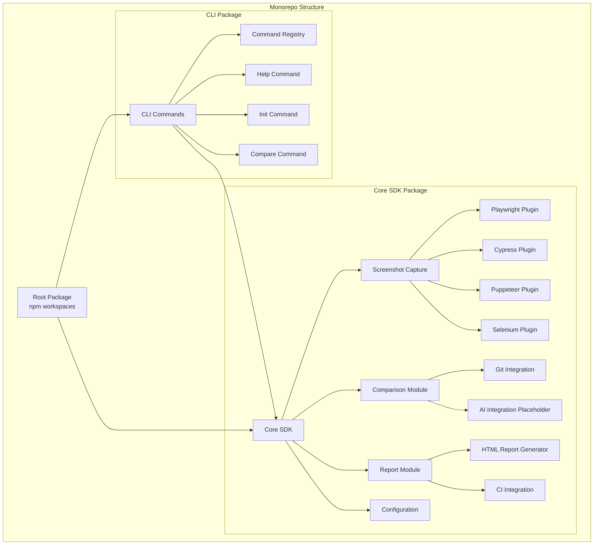
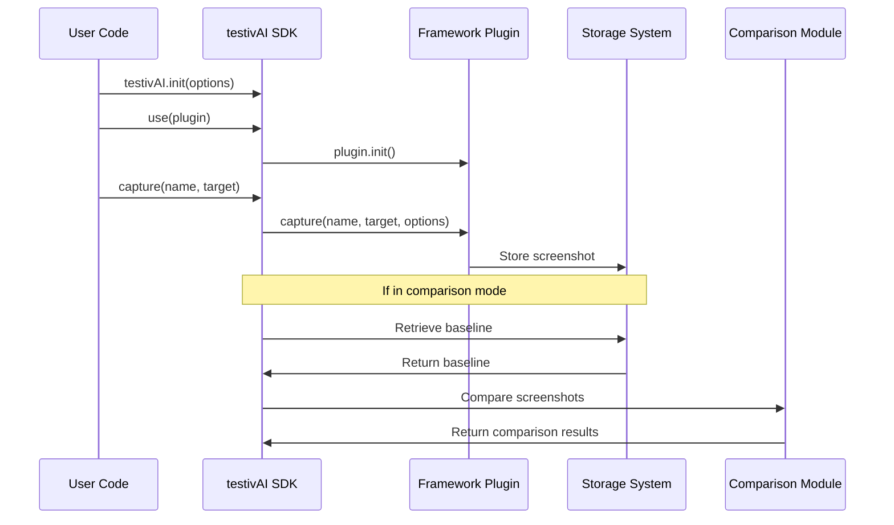
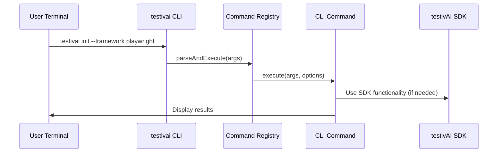
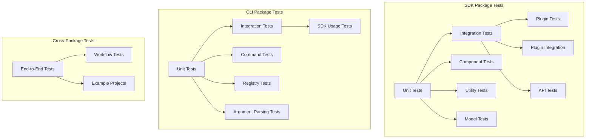
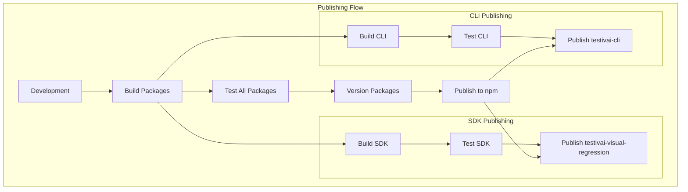

# System Patterns: TestiVAI Visual Regression

## System Architecture

The TestiVAI Visual Regression system has been transformed into a monorepo architecture with two separate packages that work together to provide comprehensive visual regression testing capabilities:

## Package Architecture

### testivai-visual-regression (Core SDK)

The foundation package that provides all visual regression testing functionality:

**Core Components:**
- **Interfaces & Types**: Common interfaces shared across the system
- **testivAI Class**: Main SDK entry point and orchestration
- **Plugin System**: Framework-specific integrations
- **Screenshot Capture**: Cross-browser screenshot functionality
- **Comparison Engine**: Image comparison and diff generation
- **Utility Functions**: File management, Git integration, path handling

**Framework Plugins:**
- Playwright integration
- Cypress integration  
- Puppeteer integration
- Selenium integration

### testivai-cli (CLI Tool)

A separate package that provides command-line interface functionality:

**CLI Components:**
- **Command Registry**: Registration and execution of CLI commands
- **Base Command Class**: Common functionality for all commands
- **Built-in Commands**: Help, Init, Compare commands
- **Argument Parsing**: Command-line argument processing
- **Colored Output**: Enhanced terminal experience

## Key Design Patterns

### 1. Monorepo Pattern

The system uses a monorepo architecture to manage multiple related packages:
- **Root Package**: Manages workspaces and shared development dependencies
- **SDK Package**: Contains core functionality, can be used independently
- **CLI Package**: Depends on SDK, provides command-line interface
- **Workspace Scripts**: Unified build and test commands across packages

### 2. Package Separation Pattern

Clear separation between SDK and CLI concerns:
- **SDK**: Framework-agnostic visual regression functionality
- **CLI**: Command-line interface that consumes SDK functionality
- **No Circular Dependencies**: CLI depends on SDK, not vice versa
- **Independent Publishing**: Each package can be versioned and published separately

### 3. Plugin Architecture (SDK)

The SDK uses a plugin architecture to support multiple testing frameworks:
- Each framework has a dedicated plugin
- Plugins implement a common interface
- Core functionality is framework-agnostic
- Plugins handle framework-specific integration

### 4. Command Pattern (CLI)

The CLI implements the command pattern for extensible command handling:
- Each CLI command is encapsulated as an object (BaseCLICommand)
- Commands can be composed and extended (HelpCommand, InitCommand, CompareCommand)
- Command registry manages registration and execution of commands
- Provides a consistent interface for different operations

### 5. Factory Pattern (SDK)

Used for creating appropriate handlers based on context:
- Screenshot capturer factory creates the right capturer for each framework
- Comparison strategy factory selects the appropriate comparison algorithm
- Report generator factory creates the right report format

### 6. Strategy Pattern (SDK)

Applied for different implementation strategies:
- Different screenshot comparison algorithms
- Various storage strategies (local, cloud, etc.)
- Multiple reporting formats

### 7. Observer Pattern (SDK)

Used for event-based interactions:
- Test framework events trigger screenshot captures
- Comparison results trigger report generation
- User actions in reports trigger baseline updates

## Data Flow

### SDK Usage Flow

### CLI Usage Flow

## Extension Points

The system is designed with several extension points:

### 1. Framework Plugins (SDK)

- Interface for adding new testing framework support
- Standardized hooks for test events
- Framework-specific screenshot capture implementation

### 2. CLI Commands

- Base command class for creating new CLI commands
- Command registry for registering custom commands
- Consistent argument parsing and help generation

### 3. Comparison Algorithms (SDK)

- Pluggable comparison strategies
- Interface for custom diff algorithms
- Support for different sensitivity configurations

### 4. Report Formats (SDK)

- Extensible reporting system
- Custom report template support
- Integration with external reporting tools

### 5. Storage Backends (SDK)

- Pluggable storage providers
- Support for local and remote storage
- Custom naming and organization strategies

### 6. AI Integration (SDK)

- Placeholder for external AI model integration
- Interface for AI-powered visual analysis
- Extensible architecture for future AI capabilities

## Critical Implementation Paths

### 1. SDK Screenshot Capture Flow

1. User calls testivAI.capture() with framework target
2. SDK validates plugin is registered for framework
3. Plugin captures screenshot using framework-specific method
4. Screenshot is processed and stored with metadata
5. Path to screenshot is returned

### 2. CLI Command Execution Flow

1. User runs testivai command with arguments
2. CLI parses command-line arguments
3. Command registry finds and executes appropriate command
4. Command performs operations (may use SDK functionality)
5. Results are displayed to user with colored output

### 3. Package Build Flow

1. Root workspace command triggers builds
2. Each package builds independently with TypeScript
3. Dependencies between packages are resolved
4. Built packages are ready for testing or publishing

### 4. Monorepo Testing Flow

1. Root workspace command triggers tests
2. Each package runs its own test suite
3. Coverage reports are generated per package
4. All tests must pass for successful build

## Testing Strategy

The TestiVAI Visual Regression system follows a comprehensive testing strategy adapted for the monorepo structure:

### 1. SDK Package Testing

- **Component Tests**: Verify individual SDK components function correctly in isolation
- **Plugin Tests**: Test framework-specific plugins with their respective frameworks
- **Integration Tests**: Test interactions between different SDK modules
- **Coverage**: 94.73% statements, 93.33% branches

### 2. CLI Package Testing

- **Command Tests**: Verify CLI commands execute correctly
- **Registry Tests**: Test command registration and execution
- **Argument Parsing Tests**: Validate command-line argument processing
- **Coverage**: 60.33% statements, 51.16% branches (appropriate for CLI tools)

### 3. Cross-Package Testing

- **Integration Tests**: Verify CLI package correctly uses SDK package
- **Workflow Tests**: Validate complete workflows from CLI to SDK
- **Example Projects**: Test with real-world example projects

### 4. Monorepo Testing Benefits

- **Isolation**: Each package can be tested independently
- **Integration**: Cross-package functionality can be verified
- **Consistency**: Shared testing patterns and utilities
- **Coverage**: Appropriate coverage thresholds for different package types

## Deployment and Publishing

### Package Publishing Strategy

### Independent Package Distribution

- **SDK Package**: Can be published and versioned independently
- **CLI Package**: Depends on SDK package, can have different release cycle
- **User Choice**: Users can install only what they need
- **Backward Compatibility**: Each package maintains its own compatibility guarantees

### Workspace Benefits

- **Unified Development**: Single repository for related packages
- **Shared Dependencies**: Common development dependencies managed at root
- **Consistent Tooling**: Shared ESLint, TypeScript, and Jest configurations
- **Simplified CI/CD**: Single repository to monitor and deploy
