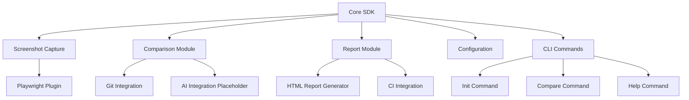
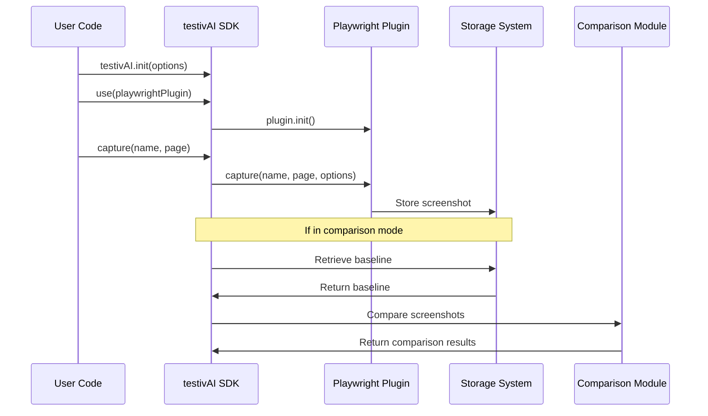
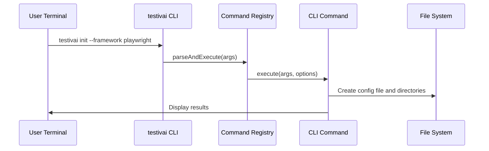
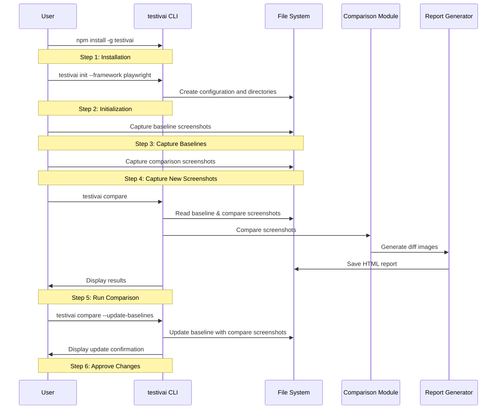
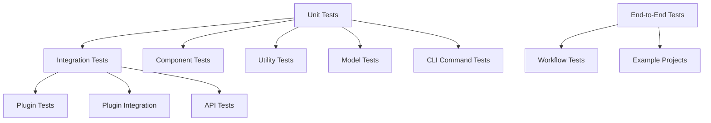

# System Patterns: testivAI Visual Regression

## System Architecture

The testivAI Visual Regression system provides comprehensive visual regression testing capabilities with a focus on Playwright integration:



## Package Architecture

### testivai

The package provides all visual regression testing functionality:

**Core Components:**
- **Interfaces & Types**: Common interfaces shared across the system
- **testivAI Class**: Main entry point and orchestration
- **Plugin System**: Framework-specific integrations
- **Screenshot Capture**: Cross-browser screenshot functionality
- **Comparison Engine**: Image comparison and diff generation
- **Utility Functions**: File management, Git integration, path handling
- **Report Generation**: Interactive HTML reports with Git short SHA history
- **CLI Commands**: Command-line interface for initialization and comparison

**Framework Plugins:**
- Playwright integration

**CLI Commands:**
- **init**: Initialize testivAI Visual Regression in a project
  - Creates configuration file (testivai.config.js)
  - Creates necessary directories (.testivai/visual-regression/baseline, compare, reports)
  - Supports customization via command-line options
  - Handles both kebab-case and camelCase options
- **compare**: Compare screenshots against baselines
  - Finds and compares screenshots
  - Generates diff images
  - Creates HTML report
  - Supports updating baselines
- **help**: Display help information
  - Lists available commands
  - Shows command-specific help
  - Displays usage examples

## Key Design Patterns

### 1. Plugin Architecture

The system uses a plugin architecture to support testing frameworks:
- Each framework has a dedicated plugin
- Plugins implement a common interface
- Core functionality is framework-agnostic
- Plugins handle framework-specific integration

### 2. Command Pattern

The CLI implements the command pattern for extensible command handling:
- Each CLI command is encapsulated as an object (BaseCLICommand)
- Commands can be composed and extended (HelpCommand, InitCommand, CompareCommand)
- Command registry manages registration and execution of commands
- Provides a consistent interface for different operations

### 3. Factory Pattern

Used for creating appropriate handlers based on context:
- Screenshot capturer factory creates the right capturer for the framework
- Comparison strategy factory selects the appropriate comparison algorithm
- Report generator factory creates the right report format

### 4. Strategy Pattern

Applied for different implementation strategies:
- Different screenshot comparison algorithms
- Various storage strategies (local, cloud, etc.)
- Multiple reporting formats

### 5. Observer Pattern

Used for event-based interactions:
- Test framework events trigger screenshot captures
- Comparison results trigger report generation
- User actions in reports trigger baseline updates

### 6. Documentation Pattern

Applied for user-friendly documentation:
- **Quick Start Guide**: Beginner-friendly "Quick Start in 5 Minutes" section
- **Step-by-Step Instructions**: Clear, concise steps with shell commands
- **Explanatory Comments**: Brief explanations of what each step does
- **Progressive Disclosure**: Basic information first, advanced options later
- **Concrete Examples**: Real shell commands that users can copy and paste

## Data Flow

### SDK Usage Flow (JavaScript/TypeScript)



### CLI Usage Flow



### Quick Start Workflow



## Extension Points

The system is designed with several extension points:

### 1. Framework Plugins

- Interface for adding new testing framework support
- Standardized hooks for test events
- Framework-specific screenshot capture implementation

### 2. CLI Commands

- Base command class for creating new CLI commands
- Command registry for registering custom commands
- Consistent argument parsing and help generation
- Option handling for both kebab-case and camelCase formats

### 3. Comparison Algorithms

- Pluggable comparison strategies
- Interface for custom diff algorithms
- Support for different sensitivity configurations

### 4. Report Formats

- Extensible reporting system
- Custom report template support
- Integration with external reporting tools

### 5. Storage Backends

- Pluggable storage providers
- Support for local and remote storage
- Custom naming and organization strategies

### 6. AI Integration

- Placeholder for external AI model integration
- Interface for AI-powered visual analysis
- Extensible architecture for future AI capabilities

### 7. Documentation Extensions

- Quick Start guide for beginners
- Advanced usage documentation for power users
- Framework-specific integration guides
- CI/CD integration examples

## Critical Implementation Paths

### 1. Screenshot Capture Flow

1. User calls testivAI.capture() with Playwright page
2. SDK validates plugin is registered
3. Plugin captures screenshot using Playwright's screenshot API
4. Screenshot is processed and stored with metadata
5. Path to screenshot is returned

### 2. CLI Command Execution Flow

1. User runs testivai command with arguments (e.g., `testivai init`)
2. CLI parses command-line arguments
3. Command registry finds and executes appropriate command
4. Command performs operations (creates files, directories, etc.)
5. Results are displayed to user with colored output

### 3. Initialization Flow

1. User runs `testivai init` command
2. CLI parses command-line arguments and options
3. InitCommand processes options (handling both kebab-case and camelCase)
4. InitCommand creates configuration file (testivai.config.js)
5. InitCommand creates necessary directories (.testivai/visual-regression/baseline, etc.)
6. User is provided with confirmation and next steps

### 4. Comparison Flow

1. User runs `testivai compare` command
2. CLI retrieves baseline and comparison screenshots
3. Comparison module compares screenshots
4. Diff images are generated
5. Report is generated with comparison results
6. Results are returned to user

### 5. Report Generation Flow

1. User calls testivAI.generateReport() or runs `testivai compare`
2. SDK retrieves comparison results
3. Report generator creates HTML report
4. Report is saved to disk
5. Path to report is returned to user

### 6. Quick Start Flow

1. User installs testivai globally
2. User runs `testivai init` to set up configuration and directories
3. User captures baseline screenshots
4. User captures new screenshots for comparison
5. User runs `testivai compare` to generate report
6. User reviews differences and approves changes if needed
7. User runs `testivai compare --update-baselines` to update baselines with approved changes

## Testing Strategy

The testivAI Visual Regression system follows a comprehensive testing strategy:



### 1. Unit Testing

- **Component Tests**: Verify individual components function correctly in isolation
- **Utility Tests**: Verify utility functions work as expected
- **Model Tests**: Verify data models and interfaces are correctly implemented
- **CLI Command Tests**: Verify CLI commands execute correctly and create expected files/directories
- **Coverage**: 89.87% statements, 85.92% branches, 90.47% functions, 89.84% lines

### 2. Integration Testing

- **Plugin Tests**: Test Playwright plugin with Playwright
- **API Tests**: Test public API functions
- **Workflow Tests**: Test end-to-end workflows

### 3. Testing Benefits

- **Isolation**: Components can be tested independently
- **Integration**: Cross-component functionality can be verified
- **Coverage**: High test coverage ensures reliability

### 4. Documentation Testing

- **Command Verification**: Verify all commands in documentation work correctly
- **Shell Command Testing**: Test shell commands in Quick Start guide
- **User Flow Testing**: Validate end-to-end user flows from documentation
- **Beginner Usability**: Test with users new to visual regression testing

## Deployment Considerations

### Package Distribution Strategy

#### Publishing
- Published as `testivai` on npm
- Follows semantic versioning

#### Installation Pattern

```bash
# For programmatic use
npm install testivai

# For CLI use (global installation)
npm install -g testivai
```

### CI/CD Integration

#### CI/CD Pipeline

```yaml
# Example GitHub Actions workflow
name: CI/CD
on: [push, pull_request]

jobs:
  test:
    runs-on: ubuntu-latest
    steps:
      - uses: actions/checkout@v2
      - uses: actions/setup-node@v2
        with:
          node-version: '16'
      - run: npm install
      - run: npm run build
      - run: npm test
      
  publish:
    needs: [test]
    if: github.ref == 'refs/heads/main'
    runs-on: ubuntu-latest
    steps:
      - uses: actions/checkout@v2
      - uses: actions/setup-node@v2
        with:
          node-version: '16'
          registry-url: 'https://registry.npmjs.org'
      - run: npm install
      - run: npm run build
      - run: npm publish
        env:
          NODE_AUTH_TOKEN: ${{ secrets.NPM_TOKEN }}
```

### Performance Optimization

#### Build Optimization
- **Incremental Builds**: Only rebuild files that have changed
- **Caching**: Leverage npm caching for dependencies

#### Test Optimization
- **Selective Testing**: Run tests only for changed files in CI
- **Coverage Optimization**: High coverage thresholds for core functionality

### Version Management

#### Versioning Strategy
- **Semantic Versioning**: Follow semver for package versioning
- **Release Notes**: Detailed release notes for each version
- **Migration Guides**: Guides for upgrading between major versions

#### Release Process
1. **Development**: Work on features in feature branches
2. **Testing**: Ensure all tests pass
3. **Versioning**: Update package version appropriately
4. **Publishing**: Publish to npm
5. **Documentation**: Update documentation and release notes
